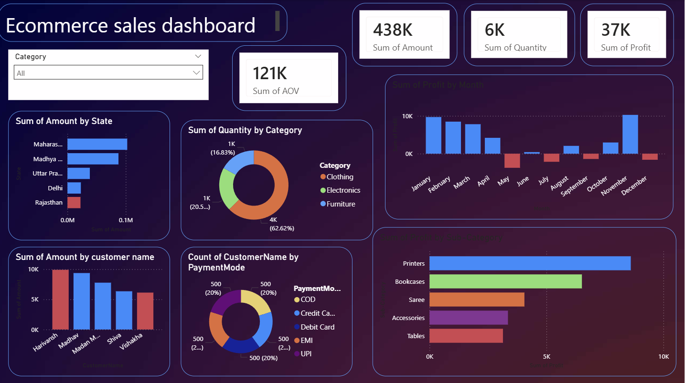

# 🛒 E-commerce Sales Analysis Dashboard

## 🎯 Project Overview
This project analyzes e-commerce sales data to uncover customer purchasing behavior, sales performance, and profit trends across categories, regions, and time periods. Insights are presented through an interactive Power BI dashboard showcasing key business metrics.

The project demonstrates the complete data analytics lifecycle:

- 🧹 Data cleaning & preprocessing using Python (pandas)
- 🔍 Exploratory data analysis (EDA)
- 📊 KPI creation
- 📈 Data visualization & dashboard development

This project is designed as a portfolio-ready example for internships, highlighting practical skills in sales analysis, business insights, and dashboard design.

## 🧩 Project Objective
- 📌 Identify top-selling products, high-performing regions, and profitable categories.
- 📌 Track monthly profit trends and customer behavior patterns.
- 📌 Provide actionable insights for business decision-making.

## 📂 Dataset Information
- Source: Kaggle
- Type: E-commerce Sales Data
- Format: CSV
- Scope: Orders, Customers, Products, Payments, Profit

## 📸 Dashboard Preview

## ⚡ Dashboard Features & Visualizations
### 📊 KPI Cards
- 💰 Total Sales Amount
- 🛒 Total Quantity Sold
- 💹 Total Profit
- 🧾 Average Order Value (AOV)

### 📈 Charts & Graphs
- Bar Chart: Sum of Sales Amount by State
- Donut Chart: Quantity distribution by Product Category
- Column Chart: Monthly Profit Trend
- Bar Chart: Top Customers by Sales Amount
- Donut Chart: Customer Count by Payment Mode
- Horizontal Bar Chart: Profit by Sub-Category

### 🗂 Filters
- 🔄 Category-wise filtering using slicers

## 🔍 Key Insights
- 📍 Top States: Maharashtra and Madhya Pradesh contribute the highest sales
- 👕 Top Category: Clothing is the most sold by quantity
- 📉 Profit Trends: Fluctuates across months, with strong year-end performance
- 🖨 Top Sub-Categories: Printers and Bookcases generate the highest profit
- 💳 Payment Mode: Evenly distributed across customers

## 🛠 Tech Stack
- Python: pandas, NumPy
- Data Visualization: Matplotlib / Seaborn (if used during preprocessing)
- Dashboard Tool: Power BI

## ▶️ How to Run the Project
- ⬇️ Download the e-commerce dataset from Kaggle
- 🧹 Perform data cleaning and preprocessing using Python (pandas)
- 💾 Export the cleaned dataset to CSV
- 📊 Load the dataset into Power BI
- 🖱 Open the `.pbix` file to explore the interactive dashboard

## 🧠 Skills Demonstrated
- 🧹 Data cleaning & preprocessing
- 🔍 Exploratory data analysis (EDA)
- 📊 KPI creation
- 💹 Sales & profit analysis
- 💡 Business insight generation
- 🖥 Interactive Power BI dashboard design
